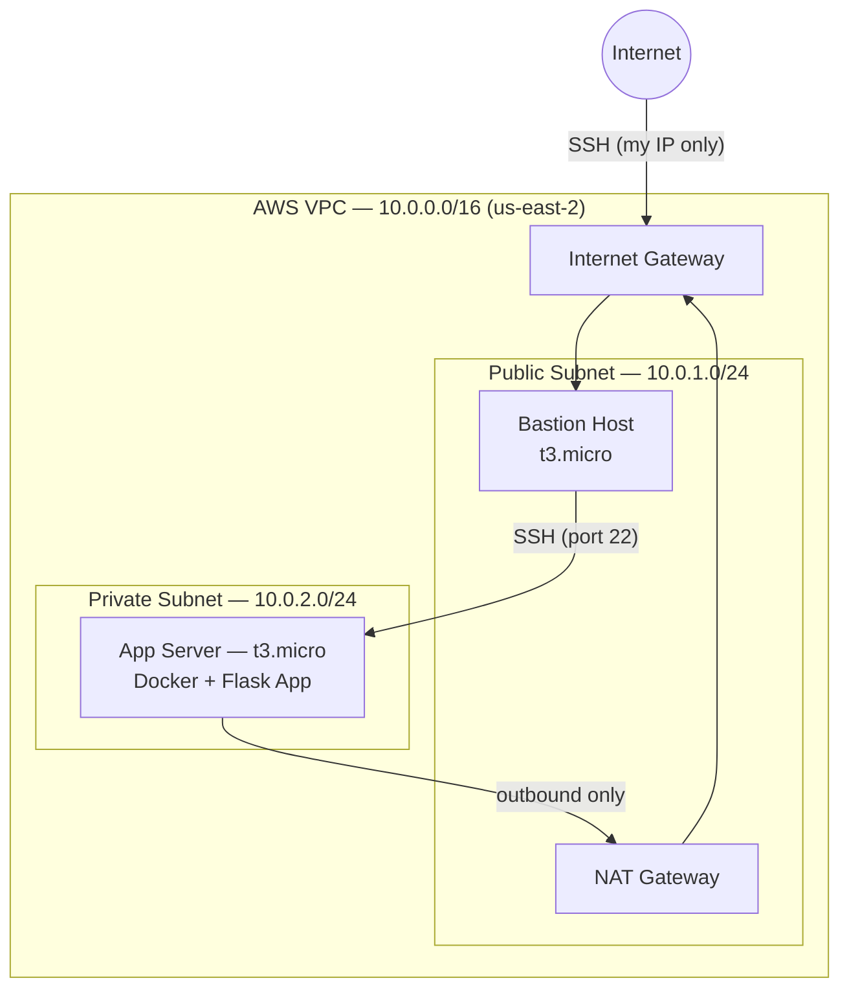
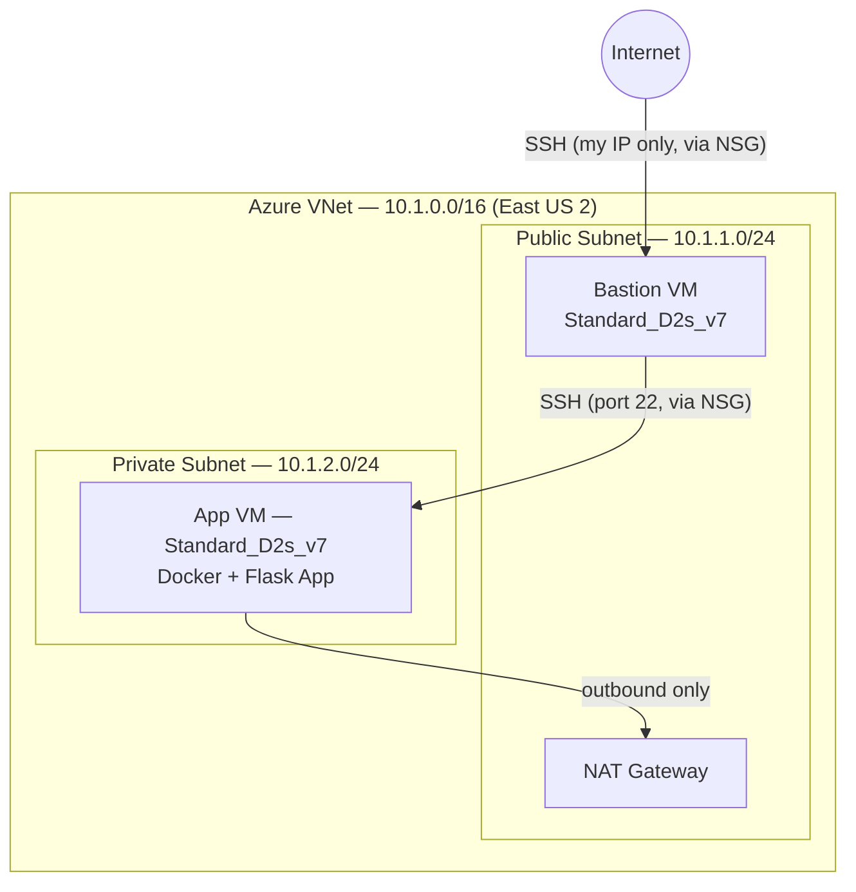

# Hybrid Cloud Migration — AWS + Azure

A parallel, functionally-identical infrastructure build on both AWS and Azure — same architecture, same containerized app, deployed independently on each platform using Terraform. Built to directly compare how the two clouds handle networking, identity, and access control, including a real security-architecture incident along the way.

**Status:** ✅ Complete

## Overview

The same Flask application is deployed behind a bastion-host architecture on both AWS and Azure: a public subnet holds a bastion host (the only thing reachable from the internet), and a private subnet holds the actual app server, reachable only through the bastion. Both environments were built with Terraform, torn down, and rebuilt from scratch to confirm full reproducibility.

## Architecture

### AWS

### Azure

Same shape on both clouds, on purpose — the point of this project is the comparison, not two different designs.

## AWS ↔ Azure comparison

| Concept | AWS | Azure |
|---|---|---|
| Isolated network | VPC | Virtual Network (VNet) |
| Network subdivision | Subnet | Subnet |
| Traffic filtering | Security Group (attached per-instance) | Network Security Group (attached per-subnet) |
| Outbound-only internet for private resources | NAT Gateway + private route table | NAT Gateway (attaches directly to subnet) |
| Internet entry point | Internet Gateway | Implicit via Public IP |
| Compute | EC2 Instance | Virtual Machine |
| Automation identity | IAM User + Access Key | Service Principal + Client Secret |
| Automation permissions | IAM Policy (e.g. AdministratorAccess) | RBAC Role (e.g. Contributor) |
| Human identity protection | MFA on root + IAM users | Security Defaults (MFA enforcement) |
| Free-tier compute sizing | `t3.micro` (this account's Free Plan — NOT the classic `t2.micro`) | `Standard_D2s_v7` (picked after `B1s`/`B2s` hit regional capacity limits) |
| Static public IP | Elastic IP | Public IP (Standard SKU) |

## What was built

1. **Two parallel network layers** — VPC/VNet, public + private subnets, internet gateway/implicit routing, NAT Gateway for outbound-only private-subnet internet access, all provisioned with Terraform.
2. **Two parallel security layers** — AWS security groups and Azure NSGs, each restricting SSH to a single known IP on the bastion, and restricting the app server/VM to only accept traffic from the bastion.
3. **Two parallel bastion-host architectures** — a public-facing bastion as the only entry point, with the actual application server sitting in a private subnet with no direct internet exposure on either platform.
4. **A dedicated automation identity on each cloud** — an IAM user (AWS) and a service principal (Azure), each scoped with only the permissions Terraform needs, instead of using root/personal credentials for infrastructure automation.
5. **The same containerized Flask app deployed independently on both clouds** — cloned from the existing `devops-project` repo, built and run via Docker on each platform's app server/VM.
6. **End-to-end verification on both platforms** — confirmed the app responds when reached through the bastion, and confirmed it is *not* reachable directly from the internet, on both AWS and Azure.
7. **Full teardown and rebuild on both clouds** — ran `terraform destroy` then `terraform apply` on both environments to confirm the entire build is reproducible from code alone.

## Incident: Azure authentication blocked by Security Defaults

Full STAR-format writeup: [`docs/incident-writeup.md`](docs/incident-writeup.md)

Short version: Terraform's initial attempt to authenticate to Azure using a personal CLI login was blocked by Azure's Security Defaults policy, which restricts non-interactive (device-code) access to Microsoft Graph. Rather than continuing to chase a fix through Azure's MFA setup pages, the authentication approach was redesigned around a dedicated **service principal** with least-privilege access — the same "don't automate with a personal/root identity" principle already applied on the AWS side with a dedicated IAM user. The fix surfaced two more real issues along the way (a mis-copied client secret, and a personal CLI session that had silently logged itself out), both diagnosed and resolved methodically, including verifying the new credentials directly via a raw OAuth request before trusting Terraform again.

Two additional real troubleshooting incidents came up during the build and are documented briefly in the same file: a Terraform version/GPG-signing-key conflict chain on AWS, and an outbound-connectivity gap in both clouds' private subnets (fixed with NAT Gateways) — discovered independently on AWS first, then avoided proactively when building the Azure side.

## Screenshots

See [`screenshots/`](screenshots/) for the full set. Evidence is CLI/terminal-based rather than console screenshots, showing actual command output at each stage:

**AWS**
- [`aws-terraform-show-1-igw-routetable.png`](screenshots/aws-terraform-show-1-igw-routetable.png) → [`aws-terraform-show-4-vpc-end.png`](screenshots/aws-terraform-show-4-vpc-end.png) — full `terraform show` output confirming the VPC, public/private subnets, Internet Gateway, and route table as actually provisioned
- [`aws-docker-install.png`](screenshots/aws-docker-install.png) — Docker installed and enabled on the app server
- [`aws-flask-app-running.png`](screenshots/aws-flask-app-running.png) — Flask container running, responding to a local `curl`
- [`aws-bastion-to-app-curl.png`](screenshots/aws-bastion-to-app-curl.png) — SSH into the bastion, then `curl` the private app server directly, proving the full bastion → app network path works end-to-end

**Azure**
- [`azure-sp-role-assignment.png`](screenshots/azure-sp-role-assignment.png) — `terraform-sp` confirmed as Contributor on the subscription (the fix for the Security Defaults incident)
- [`azure-nsg-terraform-apply.png`](screenshots/azure-nsg-terraform-apply.png) — NSG `terraform apply` completing cleanly (bastion + app security groups and their subnet associations)
- [`azure-bastion-ssh-banner.png`](screenshots/azure-bastion-ssh-banner.png) — SSH into the Azure bastion host

AWS account ID and one identifying IP address were redacted from these images before publishing.

Not currently included: an Azure-side equivalent of the AWS bastion→app curl (both environments were verified working, but this specific shot wasn't captured before teardown), AWS Console/Azure Portal screenshots, and a screenshot of the destroy → rebuild reproducibility test. The [incident writeup](docs/incident-writeup.md) and this README describe that work in detail even where a screenshot isn't available.

## Skills demonstrated

Terraform (multi-cloud, provider configuration, state management, resource dependencies), AWS (VPC, EC2, Security Groups, NAT Gateway, IAM), Azure (VNet, Virtual Machines, NSGs, NAT Gateway, Entra ID / App Registrations, RBAC), Docker, Linux administration, SSH bastion-host architecture and agent forwarding, cloud identity and access management design, systematic incident troubleshooting across two different cloud platforms.

## Resume bullets

- Deployed parallel, functionally-identical infrastructure on AWS and Azure (VPC/VNet with public/private subnets, NAT Gateway, bastion-host architecture, containerized app server) using Terraform, directly comparing IAM vs RBAC, security groups vs NSGs, and EC2 vs Azure VM service models.
- Diagnosed and resolved a real Azure identity/security incident in which Security Defaults blocked Terraform's personal-account authentication; redesigned the authentication approach around a dedicated service principal with least-privilege access, mirroring IAM best practice already applied on the AWS side of the same project.
- Diagnosed and resolved outbound-connectivity failures in private subnets on both cloud platforms (package installs hanging with no internet access) by implementing NAT Gateways — identified and fixed the same architectural gap independently on two different clouds.
- Containerized and deployed a Flask application to isolated private subnets on both AWS and Azure, verifying end-to-end reachability exclusively through a bastion host and confirming no direct internet exposure on either platform.
- Validated infrastructure reproducibility by fully tearing down and rebuilding both cloud environments from Terraform code alone.

## Lessons learned

- "Automate with a dedicated, least-privilege identity — never root or your personal account" is a principle that holds on both AWS (IAM user) and Azure (service principal), even though the two platforms implement it very differently.
- Azure's Security Defaults can block non-interactive (device-code) access to Microsoft Graph even when the same login works fine for other operations — a service principal with client-credentials auth sidesteps this entirely, and is the correct production pattern anyway.
- A private subnet with no NAT Gateway has no outbound internet access at all, not just no inbound — this breaks basic things like package installs, not just "external" traffic, and it's an easy gap to miss until something silently hangs.
- Not every documented "default" VM/instance size is actually available at a given moment — AWS's Free Plan didn't accept `t2.micro` (only newer sizes like `t3.micro`), and Azure's `Standard_B1s`/`B2s` hit real capacity restrictions in this region — checking actual availability (`aws ec2 describe-instance-types`, `az vm list-skus`) beats assuming a docs example will just work.
- Azure App Registration client secrets show two similar-looking values — "Secret ID" and "Value" — only "Value" is the real credential; this is an easy, well-documented mistake to make once and never again.
- Building infrastructure entirely in Terraform means the whole environment can be torn down when not in use and rebuilt in minutes — confirmed this directly by destroying and reapplying both environments.
